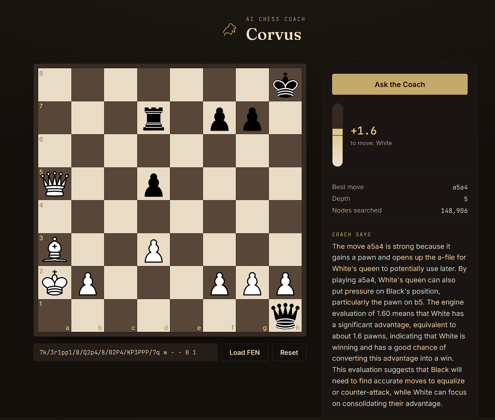
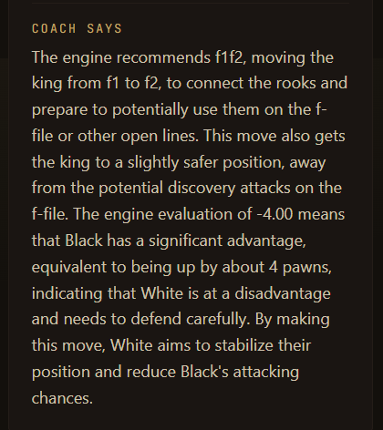

# 🐦 Corvus — AI Chess Coach

**Corvus** is an AI-powered chess coaching application that combines the analysis of the **Kestrel chess engine** with **Groq's LLM** to provide clear, human-readable explanations of chess positions and recommended moves.

Instead of simply telling you *what* the best move is, Corvus aims to explain **why** the move is strong and what chess ideas are behind it.

## ✨ Features

* ♟️ Interactive chessboard
* 🖱️ Drag-and-drop piece movement
* 📋 Load any chess position using FEN
* 🧠 Analysis powered by the **Kestrel chess engine**
* 📊 Engine evaluation in centipawns
* 🎯 Best-move recommendation
* 🔎 Search depth and nodes searched
* 🤖 AI-powered explanations using **Groq**
* 💬 Plain-English coaching feedback
* 🔄 Reset and analyze different positions

## 🏗️ Architecture

```text
                    ┌─────────────────────┐
                    │   React Frontend    │
                    │   (chess-coach-ui)  │
                    └──────────┬──────────┘
                               │
                               │ POST /api/analyze
                               │ { FEN, options }
                               ▼
                    ┌─────────────────────┐
                    │    Express API      │
                    │     (server.js)     │
                    └──────────┬──────────┘
                               │
                    ┌──────────┴──────────┐
                    │                     │
                    ▼                     ▼
          ┌─────────────────┐   ┌─────────────────┐
          │ Kestrel Engine  │   │   Groq LLM      │
          │    (UCI)        │   │  AI Explanation │
          └────────┬────────┘   └────────┬────────┘
                   │                     │
                   │ Evaluation          │ Explanation
                   └──────────┬──────────┘
                              ▼
                    ┌─────────────────────┐
                    │  Coaching Response  │
                    │  Best Move + Why    │
                    └─────────────────────┘
```

## 🧠 How It Works

Corvus uses a two-stage analysis pipeline.

### 1. Chess Engine Analysis

The backend starts **Kestrel** as a UCI-compatible child process.

Kestrel analyzes the supplied FEN position and returns information such as:

* Best move
* Position evaluation
* Search depth
* Nodes searched

For example:

```text
Best Move: e2e4
Evaluation: +0.25
Depth: 6
Nodes: 45213
```

### 2. AI Coaching Explanation

The engine's raw analysis is then sent to **Groq's LLM API**.

Instead of exposing only a numerical evaluation such as:

```text
+0.25
```

Corvus converts the engine's analysis into a human-readable explanation describing the chess idea behind the recommended move.

This makes the engine output more useful for **learning and improvement**, rather than simply finding moves.

## ⚙️ Tech Stack

### Frontend

* React
* Vite
* JavaScript
* Chess.js
* CSS

### Backend

* Node.js
* Express.js
* JavaScript
* Child processes
* UCI communication

### Chess Engine

* Kestrel
* C++17
* UCI protocol
* Alpha-beta search
* Custom evaluation heuristics

### AI

* Groq API
* Large Language Model for chess explanations

## 📂 Project Structure

```text
Corvus/
│
├── server.js          # Express API server
├── engine.js          # Kestrel UCI communication
├── coach.js           # Groq AI explanation
├── package.json
├── package-lock.json
├── kestrel.exe        # Kestrel engine binary
│
└── chess-coach-ui/
    │
    ├── src/
    │   ├── App.jsx
    │   ├── App.css
    │   ├── EvalGauge.jsx
    │   └── ...
    │
    ├── package.json
    └── vite.config.js
```

## 🚀 Getting Started

### Prerequisites

Make sure you have:

* Node.js 18+
* A compiled Kestrel engine binary
* A Groq API key

You can find the Kestrel engine here:

https://github.com/kishan4906/Kestrel

### 1. Clone the Repository

```bash
git clone https://github.com/kishan4906/Corvus.git
cd Corvus
```

### 2. Install Backend Dependencies

```bash
npm install
```

### 3. Add Kestrel

Place the compiled Kestrel executable in the backend directory.

On Windows:

```text
kestrel.exe
```

On Linux/macOS:

```text
kestrel
```

### 4. Configure Groq

Set your Groq API key as an environment variable.

PowerShell:

```powershell
$env:GROQ_API_KEY="your_api_key_here"
```

Linux/macOS:

```bash
export GROQ_API_KEY="your_api_key_here"
```

### 5. Start the Backend

```bash
node server.js
```

The backend should run on:

```text
http://localhost:3001
```

### 6. Start the Frontend

Open another terminal:

```bash
cd chess-coach-ui
npm install
npm run dev
```

Then open:

```text
http://localhost:5173
```

## 🔌 API

### Analyze Position

**POST**

```text
/api/analyze
```

Example request:

```json
{
  "fen": "rnbqkbnr/pppppppp/8/8/8/8/PPPPPPPP/RNBQKBNR w KQkq - 0 1",
  "movetimeMs": 800,
  "explain": true
}
```

Example response:

```json
{
  "bestMove": "e2e4",
  "scoreCp": 25,
  "depth": 6,
  "nodes": 45213,
  "explanation": "e4 is a strong developing move that immediately fights for the center..."
}
```

### Health Check

**GET**

```text
/api/health
```

This endpoint can be used to check whether the Kestrel engine process is available.

## 🎯 Why Corvus?

Traditional chess engines are excellent at calculating positions, but their output can be difficult for beginners and intermediate players to understand.

For example:

```text
Engine:
+0.82
Best move: Nf3
```

Corvus attempts to turn that into:

> **Nf3 is strong because it develops the knight, controls important central squares, and prepares kingside castling while increasing pressure on the center.**

The goal is to bridge the gap between **engine calculation** and **human understanding**.

## 🔬 Kestrel

Corvus uses **Kestrel**, a custom-built chess engine developed in C++17.

Kestrel communicates with Corvus through the **Universal Chess Interface (UCI)** protocol, allowing the JavaScript backend to control the engine and retrieve its analysis.

Kestrel repository:

https://github.com/kishan4906/Kestrel

## 🔐 Environment Variables

Corvus expects the following environment variable:

```text
GROQ_API_KEY=your_api_key_here
```

**Never commit your API key to GitHub.**

## 📸 Screenshots

Add screenshots of the application here:

```markdown



```

## 🛣️ Future Improvements

Potential improvements include:

* [ ] Move-by-move game analysis
* [ ] Blunder detection
* [ ] Accuracy scoring
* [ ] Opening recognition
* [ ] Multiple coaching styles
* [ ] Game history
* [ ] PGN import
* [ ] Automatic analysis after every move
* [ ] Deeper engine analysis
* [ ] Improved AI coaching prompts
* [ ] Deployment support

## 👨‍💻 Author

**Kishan Kushwaha**

Corvus combines a custom chess engine with modern AI to create a more understandable chess-analysis experience.

---

⭐ If you find the project interesting, consider giving the repository a star!
